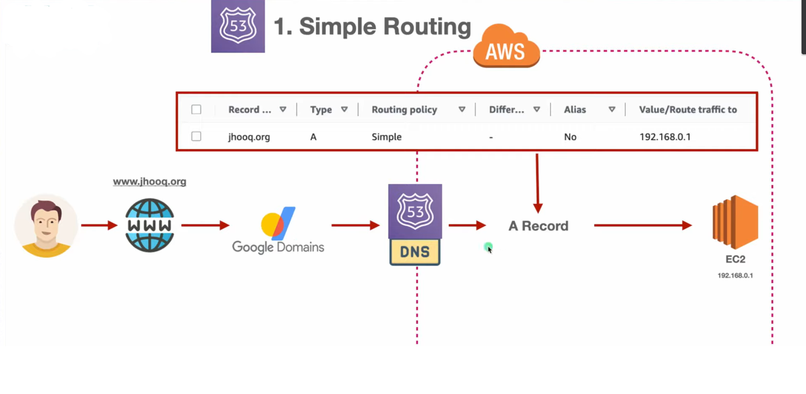

# AWS Route 53 Routing Policies

## 📌 What is Route 53 Routing?
AWS **Route 53** provides various routing policies to direct domain traffic efficiently based on specific conditions, such as **traffic distribution, location, and failover mechanisms**. Below are the primary routing types used in Route 53.
---

## 🛠 **Simple Routing**
### **Steps to Configure Simple Routing**
1️⃣ **Create a Hosted Zone** (Public Hosted Zone for domain management).  
2️⃣ **Configure the Name Server** in your domain registrar (GoDaddy, Namecheap, etc.).  
3️⃣ **Create an EC2 Instance** that will use the domain name.  
4️⃣ **Create a DNS Record** pointing to the EC2 instance with **Simple Routing**.

**📌 Simple Routing with Load Balancer**
If multiple EC2 instances exist, use a **Load Balancer**:
1. **Create a VPC** (`12.0.0.0/16`).
2. **Create Subnets**: 
   - Public Subnet 1 (`12.0.1.0/24`)
   - Public Subnet 2 (`12.0.2.0/24` for availability)
   - Private Subnet (`12.0.3.0/24`)
3. **Attach an Internet Gateway** to the VPC.
4. **Configure Route Tables**:
   - Public Subnets → `0.0.0.0/0` (Internet Access)
   - Private Subnets → No Internet Access
5. **Launch EC2 Instances** in the VPC.
6. **Create a Target Group** for the Load Balancer.
7. **Create an Application Load Balancer (ALB)** and attach the EC2 instances.
8. **Create an A Record** in Route 53 that routes to the Load Balancer.

---

## ⚖️ **Weighted Routing**
Weighted Routing allows traffic to be distributed between multiple resources based on assigned weights.

### **Steps to Configure Weighted Routing**
1. **Set up the VPC and subnets** as described above.
2. **Create VPC-2** for an additional weighted routing setup.
3. **Launch multiple EC2 Instances** in different VPCs.
4. **Create Target Groups** for each set of EC2 instances.
5. **Deploy multiple Load Balancers** to distribute traffic.
6. **Create Weighted Records** in Route 53, assigning different weights to each instance.

📌 Example: Route **70% traffic** to `EC2-1` and **30% traffic** to `EC2-2`.

---

## 🌍 **Geolocation-Based Routing**
Routes users based on their geographic location.

### **Example Use Case:**
- If a user is in **India**, they are routed to **Instance-1**.
- If a user is in the **US**, they are routed to **Instance-2**.

### **Steps to Configure Geolocation-Based Routing**
1. **Create EC2 Instances** in multiple AWS regions (India, US, etc.).
2. **Create a Load Balancer** in each region.
3. **Create Geolocation Records** in Route 53 to route based on the user's location.

---

## 🔄 **Failover Routing**
Failover Routing ensures high availability by redirecting traffic to a secondary instance if the primary instance fails.

### **Steps to Configure Failover Routing**
1. **Create a Primary EC2 Instance** with an Elastic Load Balancer (ELB).
2. **Create a Secondary EC2 Instance** as a backup.
3. **Configure Health Checks** in Route 53 to monitor the primary instance.
4. **If the primary instance fails**, Route 53 automatically switches traffic to the secondary instance.

---

## 📌 **Summary**
| Routing Type | Purpose |
|-------------|---------|
| **Simple Routing** | Directs traffic to a single instance or load balancer. |
| **Weighted Routing** | Distributes traffic based on assigned weights. |
| **Geolocation-Based Routing** | Routes users based on their location. |
| **Failover Routing** | Redirects traffic to a backup instance if the primary fails. |

By using **AWS Route 53**, you can **improve performance, scalability, and reliability** of your application’s DNS resolution.

Let me know if you need further modifications or additional images! 🚀
