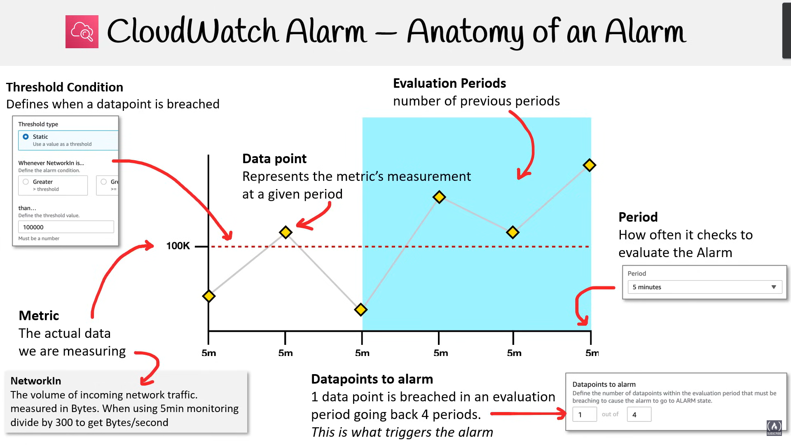

# CloudWatch Monitoring: Host-Level vs. Agent-Level

## 1. Resolution in CloudWatch Metrics

- **Standard Resolution**: Data points collected every **1 minute** (default).
- **High Resolution**: Data points collected every **1 second** (custom metric, additional cost).
- **Example**: Monitoring EC2 CPU utilization at **1-minute vs. 1-second** intervals.

## 2. Basic vs. Detailed Monitoring

### Basic Monitoring

- Data collected at **5-minute intervals**.
- **Free**.
- Suitable for **general performance monitoring**.

### Detailed Monitoring

- Data collected at **1-minute intervals**.
- **Paid feature**.
- Useful for **real-time monitoring** and **Auto Scaling decisions**.

| Feature             | Basic Monitoring   | Detailed Monitoring            |
| ------------------- | ------------------ | ------------------------------ |
| Collection Interval | 5 minutes          | 1 minute                       |
| Cost                | Free               | Paid                           |
| Use Case            | General monitoring | Real-time performance tracking |

## 3. Host-Level vs. Agent-Level Monitoring

### Host-Level Monitoring (AWS Default)

- AWS **automatically** collects metrics (e.g., **CPU Utilization, Network I/O, Disk I/O**).
- **Does not include memory usage, disk space utilization, or application metrics**.
- **Example**: Monitoring **CPU Utilization** for an EC2 instance without additional setup.

### Agent-Level Monitoring (Using CloudWatch Agent)

- Requires **installing CloudWatch Agent** inside the instance.
- Collects **detailed metrics** (e.g., **Memory, Disk Usage, Application Logs**).
- Supports **custom metrics** and **high-resolution (1-second) monitoring**.
- **Example**: Monitoring **Memory Utilization** by installing CloudWatch Agent on EC2.

| Feature             | Host-Level Monitoring           | Agent-Level Monitoring                      |
| ------------------- | ------------------------------- | ------------------------------------------- |
| Setup               | No setup needed                 | Requires CloudWatch Agent                   |
| Data Collection     | CPU, Network, Disk I/O          | Memory, Disk Space, Logs, Custom Metrics    |
| Monitoring Interval | 1 min (Detailed), 5 min (Basic) | 1 sec, 10 sec, 1 min (Configurable)         |
| Custom Metrics      | Not supported                   | Supported                                   |
| Cost                | Free (Basic), Paid (Detailed)   | Additional cost for logs and custom metrics |

## 4. When to Use Host-Level vs. Agent-Level Monitoring?

| Scenario                              | Use Host-Level | Use Agent-Level |
| ------------------------------------- | -------------- | --------------- |
| Monitoring CPU, Network, Disk I/O     | ✅              | ❌               |
| Monitoring Memory, Disk Usage         | ❌              | ✅               |
| Collecting Application Logs           | ❌              | ✅               |
| Auto Scaling based on CPU Utilization | ✅              | ❌               |
| Real-time, High-Resolution Metrics    | ❌              | ✅               |
| Monitoring on-premise servers         | ❌              | ✅               |

## Conclusion

- **Use Host-Level Monitoring** for basic system metrics like **CPU and network performance**.
- **Use Agent-Level Monitoring** for **detailed metrics, log collection, and real-time monitoring**.
- **Agent-Level Monitoring** is ideal for **custom alerts and application-level monitoring**.

---

# CloudWatch Alarm – Anatomy of an Alarm

## Overview
Amazon CloudWatch Alarms help monitor AWS resources by tracking metrics and triggering notifications or automated actions when thresholds are breached.

---

## Key Components of a CloudWatch Alarm

### 1. **Metric**
- The actual data being monitored.
- **Example:** `NetworkIn` (incoming network traffic measured in bytes).

### 2. **Threshold Condition**
- Defines when an alarm should trigger.
- **Example:** If `NetworkIn > 100,000 bytes`, the threshold is breached.

### 3. **Data Points**
- Each metric measurement at a specific period.
- Shown as yellow diamonds in the diagram.

### 4. **Period**
- Defines how often CloudWatch checks the metric.
- **Example:** A `5-minute` period means a new data point is recorded every `5 minutes`.

### 5. **Evaluation Periods**
- The number of past periods considered before triggering an alarm.
- **Example:** `4 periods` (20 minutes total) are checked before raising an alarm.

### 6. **Datapoints to Alarm**
- Specifies how many data points must breach the threshold for an alarm to trigger.
- **Example:** `1 out of 4`, meaning if **1 data point** breaches the threshold within the last **4 periods**, the alarm is activated.

---

## Example Use Cases

### **Example 1: Monitoring CPU Usage**
- **Metric:** `CPUUtilization`
- **Threshold:** `> 85%`
- **Period:** `1 minute`
- **Evaluation period:** `5`
- **Datapoints to alarm:** `3 out of 5`

💡 **Alarm triggers if CPU usage exceeds 85% in 3 out of the last 5 minutes.**

### **Example 2: Monitoring Disk Space**
- **Metric:** `DiskUsedPercent`
- **Threshold:** `> 90%`
- **Period:** `5 minutes`
- **Evaluation period:** `6`
- **Datapoints to alarm:** `2 out of 6`

💡 **Alarm triggers if disk usage exceeds 90% in 2 out of the last 6 periods (30 minutes).**

---

## Summary
- **CloudWatch Alarms help detect and respond to performance issues.**
- Metrics like **CPU, memory, network traffic, and disk usage** can be monitored.
- **Thresholds define when an alarm is triggered.**
- **Evaluation periods and datapoints to alarm ensure stability before raising an alert.**

🚀 **Use CloudWatch Alarms to automate scaling, alert teams, and ensure system reliability!**
