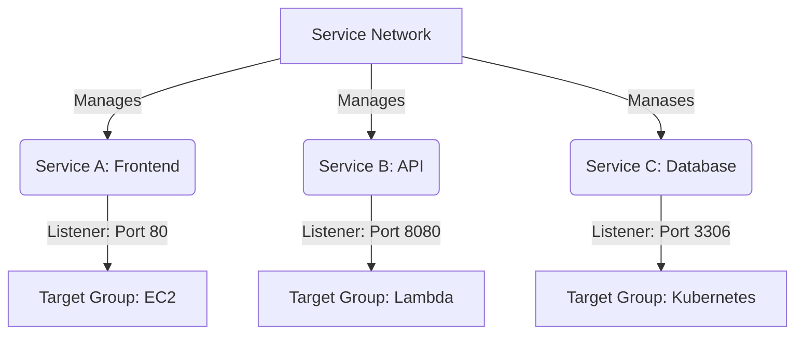

# AWS VPC Lattice: Simplified Service Networking

VPC Lattice is a fully managed AWS service that simplifies connecting, securing, and monitoring communication between distributed services (e.g., EC2, Lambda, containers) **across VPCs and AWS accounts**.

---

## Key Components

### 1. **Service Network** 🌐
- The logical boundary where services communicate.
- Centralizes security policies (e.g., authentication) and routing rules.
- Example: A shared "highway" for all connected services.

### 2. **Service** 🛠️
- Your application or resource (e.g., EC2, Lambda, Kubernetes pods).
- Includes:
  - **Listeners**: Entry points for traffic (e.g., HTTP/HTTPS on port 80).
  - **Rules**: Direct traffic to specific backends (e.g., `/api` → Lambda).
  - **Default Rules**: Fallback actions for unmatched requests.

### 3. **Target Group** 🎯
- Groups of backend resources (EC2, Lambda, ALBs) that process requests.
- Example: A target group for API endpoints and another for static content.

### 4. **Service Directory** 📖
- A registry of all available services (owned or shared via AWS RAM).
- Acts as a "phonebook" for service discovery.

---

## Example Architecture



## How It Works:
- Service A (Frontend) receives HTTP traffic on port 80.

### Rules direct:

- /api requests → Service B (Lambda).

- /data requests → Service C (Kubernetes).

- Target Groups map to actual resources (EC2, Lambda, etc.).

- Service Directory lists all services for easy discovery.


## 1. Create a Service Network
```sh
aws vpc-lattice create-service-network --name "MyNetwork" --auth-type AWS_IAM
```
## 2. Register Services
```sh
# Example YAML configuration
Services:
  - ServiceA (EC2):
      Listener:
        Port: 80
        Protocol: HTTP
  - ServiceB (Lambda):
      Listener:
        Port: 8080
        Protocol: HTTP
```


## 3. Define Routing Rules

```sh
# Example: Route /api to Lambda and /static to EC2
aws vpc-lattice create-rule \
  --service-identifier "ServiceB" \
  --match '{"httpMatch":{"pathMatch":{"match":{"exact":"/api"}}}}' \
  --action '{"forward":{"targetGroups":[{"weight":100,"targetGroupIdentifier":"lambda-tg"}]}}'
```

## Why Use VPC Lattice?
- ✅ Simplified Networking: No VPC peering, VPNs, or manual routing.

- ✅ Centralized Security: Enforce encryption, IAM policies, and traffic monitoring.

- ✅ Cross-Account/VPC Connectivity: Connect services across AWS accounts and VPCs seamlessly.


---

## How to Use This README
1. Copy the entire markdown above into your repository’s `README.md`.
2. Update the example services, ports, and rules to match your architecture.
3. The Mermaid diagram will render automatically on GitHub.

This provides a clear, actionable guide for anyone exploring or implementing VPC Lattice! 🚀  